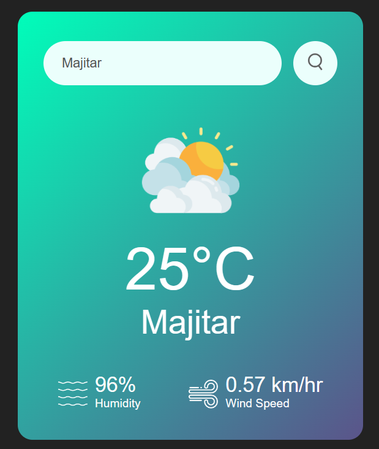

# Weather App


A simple weather app that allows you to check the weather conditions in different cities.

## Features

- Enter a city name to get the current weather.
- View temperature, humidity, and wind speed.
- Error message for invalid city names.

## Usage

1. Clone this repository to your local machine:

   ```bash
   git clone https://github.com/amnullh/Weather-App.git
   ```

2. Open the `index.html` file in your web browser.

3. Enter a city name in the input field and click the search button.

4. The app will display the current weather conditions for the entered city.

## Preview



## Technologies Used

- HTML
- CSS
- JavaScript
